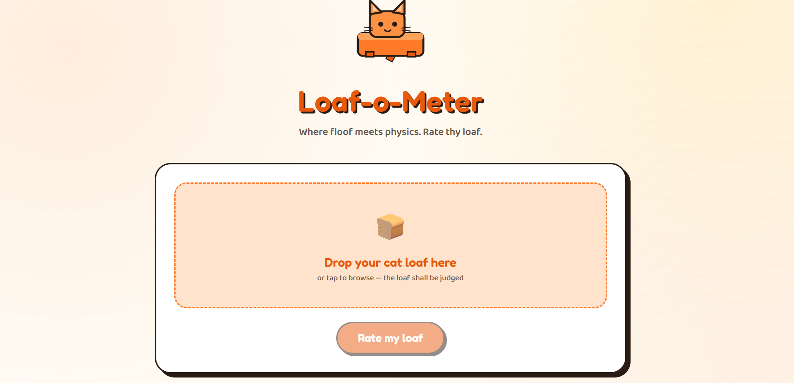

# [Loaf-o-Meter] 🎯

## Basic Details
### Team Name: [Kurup Family]

### Team Members
- Member 2: [Raghav S Kurup] - [ Model Engineering College]
- Member 3: [Madhav R] - [ Model Engineering College]

### Project Description
[Loaf-o-Meter is a playful AI-powered web application that judges how perfectly a cat has achieved legendary "loaf" pose. Users upload a cat , and the app uses an image-analysis API to examine cat's posture, paws, tail, head position, and facial expression before awarding it a score out of 10.]

### The Problem (that doesn't exist)
[How can we turn the simple act of judging whether a cat is "loafing" into a fun, interactive experince?]

### The Solution (that nobody asked for)
[It takes the extremely important task of judging cats loaf and gives it the scientific treatment it absolutely does not deserve.]

## Technical Details
### Technologies/Components Used
For Software:
- [HTML, Java Script, CSS]
- [React.js,Node.js,Vite]
- [Open AI SDK, React]
- [VS Code,Git&Git hub]

### Implementation
For Software:
# Installation
[npm install]

# Run
[npm run]

### Project Documentation
For Software:

# Screenshots (Add at least 3)

*

*Add caption explaining what this shows*

*Add caption explaining what this shows*

# Diagrams

*Add caption explaining your workflow*

### Project Demo
# Video
[Add your demo video link here]
*Explain what the video demonstrates*

# Additional Demos
[Add any extra demo materials/links]

## Team Contributions
- [Name 1]: [Specific contributions]
- [Name 2]: [Specific contributions]
- [Name 3]: [Specific contributions]

---
Made with ❤️ at TinkerHub Useless Projects 

